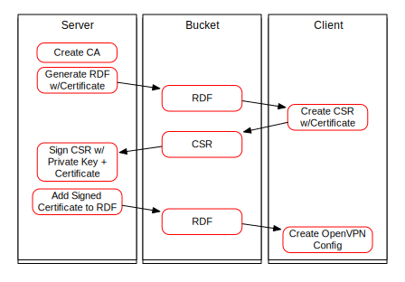

Overview
========

The general idea is a VPN connection from each laptop to a central
Linux server, where all the VPN connections are connected to a Linux
bridge.  When the interfaces on each laptop are configured, the
laptops can talk to each other.

There are several layers of things to build over that basic idea.

## TLS/SSL

Since this must be a secure connection, we use TLS for encryption.
Also, access is controlled by a client certificate used on each
laptop to initiate the VPN connection to the server.  This means
that the VPN server will act as a certificate authority.

